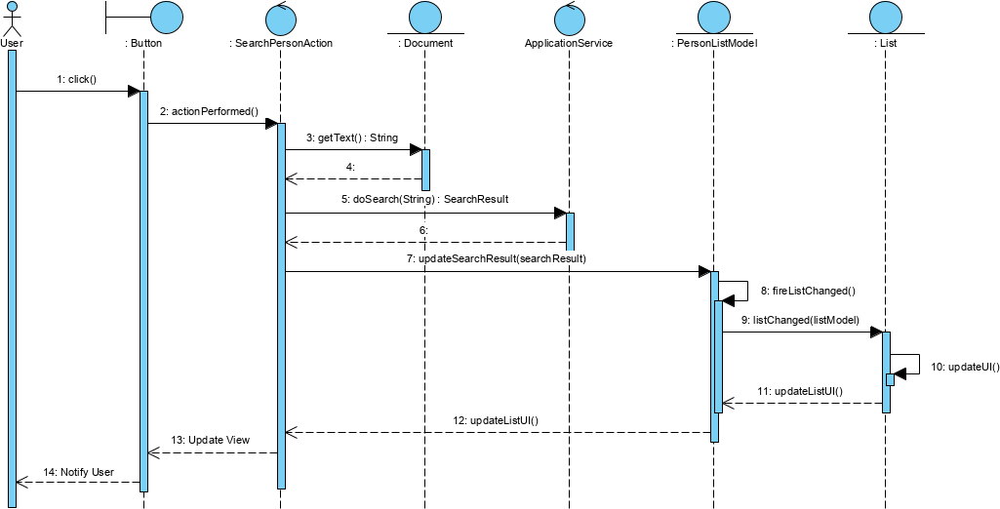
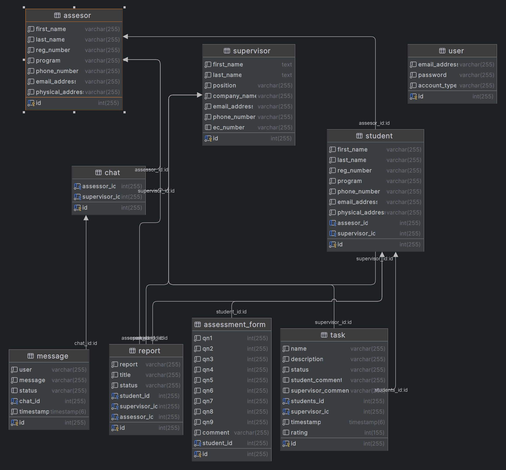

<a name="readme-top"></a>

<!-- PROJECT LOGO -->
<br />
<div align="center">
  <a href="https://github.com/kudzaiprichard/online-assessment-portal">
    
  </a>

  <h3 align="center">Online Assessment Portal</h3>

  <p align="center">
    An online portal for assessing students on internship 
    <br />
  </p>
  <br/>
</div>

<!-- TABLE OF CONTENTS -->
<details>
  <summary>Table of Contents</summary>
  <ol>
    <li>
      <a href="#about-the-project">About The Project</a>
      <ul>
        <li><a href="#project-scope">Project Scope</a></li>
        <li><a href="#project-design">Project Design</a></li>
        <li><a href="#built-with">Built With</a></li>
      </ul>
    </li>
    <li>
      <a href="#getting-started">Getting Started</a>
      <ul>
        <li><a href="#prerequisites">Prerequisites</a></li>
        <li><a href="#installation">Installation</a></li>
        <li><a href="#contributing">Contributing</a></li>
      </ul>
    </li>
    <li><a href="#license">License</a></li>
    <li><a href="#contact">Contact</a></li>
    <li><a href="#acknowledgments">Acknowledgments</a></li>
  </ol>
</details>

<!-- ABOUT THE PROJECT -->
# About The Project

### Project Scope

Online internship assessment is the process of conducting a student assessment through reports, communicating with the 
students work supervisor on students progress and grading the student online. Online assessments comprise a series of 
tasks and reports that assess multiple aspects of a task-taker and are created based on the job role, level and competency 
requirements. Such assessments offer an objective evaluation of a student’s capabilities and predict on-the-job performance.

* Students, supervisors and assesses should be able to create and manage there accounts
* Supervisors should be able to assign tasks to students, grade and comment on the performance of each task
* Student should write weekly reports and submit them to their assesses after there approved by the supervisor
* Supervisor should be able to communicate with the student assessor via chat 
* Supervisor should also be able to view the students progress on the platform

## Project Design

### Architecture
MVC (Model-View-Controller) is an `architectural design pattern` that encourages improved `application organization` through 
a `separation of concerns`. It divides an interactive application into `three components`: `Model` / `View` and `Controller`. 
It enforces the isolation of business data (Models) from user interfaces (Views), with a third component (Controllers) 
traditionally managing logic, user-input and coordinating both the models and views. The goal of MVC is to help structure 
the `separate the concerns` of an application into `three parts`:

<div align="center">
    
</div>

1. `Model`
   * The model is the layer that keeps data for the application. The layer is responsible for storing and retrieving data 
        from the database, and it is also responsible for validating the data.
    > For example, if you want to create a new user, you will have to create a new user model and save it to the database.

2. `View`
   * It is the layer used to present the application. It is used to display the data to the end-user.
    > For instance, if you want to create a user view, you will have to create UI components that the user interacts with, such as a login form in an easy-to-understand format.

3. `Controller`
   * The controller is the logic layer of the application. It is responsible for processing the user’s request and generating the response. It links the view and the model.

### MVC Sequence Diagram
Suppose an application that let you search for persons. The UI must have a `text field` where the user can enter a `search 
string`, and it might have a button to start the search. Finally, it must have an area where the search `results are displayed`. 
In our case, it is implemented with a `list component`.

The `Search for Persons` use case Scenario is:
* The user enters a search string in the text field
* The user clicks the search button.
* The search result is displayed in the result list.

<div align="center">
    
</div>

> The sequence diagram above shows how the user’s button click moves through the application until the result gets finally 
displayed in the list component.

### UML Diagram

<div align="center">
    
</div>

> Above is the UML design of the system including relationships between the difference objects that make up the system

### Built With
Used `PHP`, `JavaScript`, `HTML`, `CSS` and `MySQL`.

<div>
    <a href="https://php.net/" title="PHP"></a>
    <a href="https://developer.mozilla.org/en-US/docs/Web/JavaScript" title="JavaScript"></a>
    <a href="https://www.w3.org/TR/html5/" title="HTML5"></a>
    <a href="https://www.w3.org/TR/CSS/" title="CSS3"></a>
    <a href="https://dev.mysql.com/" title="MySQL"></a>
</div>

<p align="right">(<a href="#readme-top">back to top</a>)</p>

<!-- GETTING STARTED -->
## Getting Started

### Prerequisites

You should have the below software installed in your pc :
* PHP 8 
* xampp 8
* MySQL
* and your preferred IDE or text editor

  

### Installation

1. Get a free API Key at [https://github.com/settings/tokens](https://github.com/settings/tokens)
2. Clone the repo

   ```sh
   git clone https://github.com/kudzaiprichard/online-assessment-portal
   ```
3. Make sure you copy the project to 
    ```
    c:/xampp/htdocs
    ```
4. Open project in IDE or text editor
5. Run xampp and start apache and mysql
6. Create and import database in php my admin 
> NB: To run the system, open desired browser and on the url bar write 
    ```
        localhost/system-folder-name
    ``` 


<p align="right">(<a href="#readme-top">back to top</a>)</p>


<!--CONTRIBUTING-->
## Contributing

If you have a suggestion that would make this better, please fork the repo and create a pull request. You can also simply open an issue with the tag "enhancement".
Don't forget to give the project a star! Thanks again!

1. Fork the Project
2. Create your Feature Branch (`git checkout -b feature/AmazingFeature`)
3. Commit your Changes (`git commit -m 'Add some AmazingFeature'`)
4. Push to the Branch (`git push origin feature/AmazingFeature`)
5. Open a Pull Request

### :fire: Contribution

 Your contributions are always welcome and appreciated. Following are the things you can do to contribute to this project.

 1. **Report a bug** <br>
 If you think you have encountered a bug, and I should know about it, feel free to report it [here]() and I will take care of it.

 2. **Request a feature** <br>
 You can also request for a feature [here](), and if it will viable, it will be picked for development.  

 3. **Create a pull request** <br>
 It can't get better than this, your pull request will be appreciated by the community. You can get started by picking up any open issues from [here]() and make a pull request.

 > If you are new to open-source, make sure to check read more about it [here](https://www.digitalocean.com/community/tutorial_series/an-introduction-to-open-source) and learn more about creating a pull request [here](https://www.digitalocean.com/community/tutorials/how-to-create-a-pull-request-on-github).

<p align="right">(<a href="#readme-top">back to top</a>)</p>


<!-- LICENSE -->
## License

> Distributed under the MIT License. See `LICENSE.txt` for more information.

<p align="right">(<a href="#readme-top">back to top</a>)</p>


<!-- CONTACT -->
## Contact

> Kudzai P Matizirofa - [linkedin.com/in/kudzai-prichard](https://linkedin.com/in/kudzai-prichard) - <kudzaiprichard@gmail.com>

Project Link: [https://github.com/kudzaiprichard/online-assessment-portal](https://github.com/kudzaiprichard/online-assessment-portal)

<p align="right">(<a href="#readme-top">back to top</a>)</p>

<!-- ACKNOWLEDGMENTS -->
## Acknowledgments

list of resources I found helpful and would like to give credit to.

* [Choose an Open Source License](https://choosealicense.com)
* [MVC Framework - Introduction](https://www.tutorialspoint.com/mvc_framework/mvc_framework_introduction.htm)
* [PHP Documentation](https://www.php.net/docs.php)
* [GitHub Pages](https://pages.github.com) 
* [MySql docs](https://dev.mysql.com/doc/)

<p align="right">(<a href="#readme-top">back to top</a>)</p>


